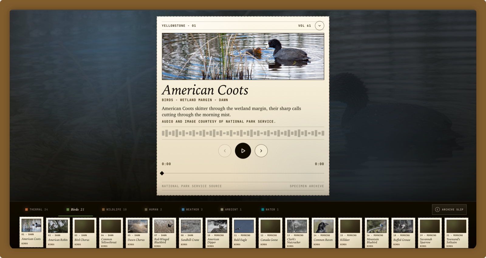

  

# rosu

I build Android products, live audio/video systems, and small tools that make digital work feel a little more humane.

Currently at [TikTok](https://www.tiktok.com/), working on creative agent systems. Before that, I spent years around live streaming, RTC, Kotlin, and the small details that make mobile interfaces feel instant and reliable.

I like software that stays close to people: a file picker that gets out of the way, a watermark app for everyday privacy, a commit helper that saves a few words, and a listening atlas made from Yellowstone's public sound archive.

## Now

- Building creative agent workflows at TikTok
- Keeping Kotlin, Android, and backend systems close by
- Turning side projects into small, shareable artifacts

## Selected Work

| Project | Notes |
| --- | --- |
| [Yellowstone Sound Atlas](https://ysl.rosuh.me/atlas/) | A playable listening atlas built from Yellowstone's public sound recordings, with a crawler and archive pipeline behind it. |
| [Easy Watermark](https://github.com/rosuH/EasyWatermark) | An Android tool for adding watermarks to photos and protecting everyday privacy. |
| [AICommit](https://aicommit.app/) | An IntelliJ IDEA plugin for AI-assisted commit messages. |
| [AndroidFilePicker](https://github.com/rosuH/AndroidFilePicker) | An open-source Android file picker library with a smooth selection experience. |

## Elsewhere

[Home](https://rosuh.me) / [Blog](https://blog.rosuh.me) / [X](https://x.com/rosu_h) / [Email](mailto:hi@rosuh.me)

  

