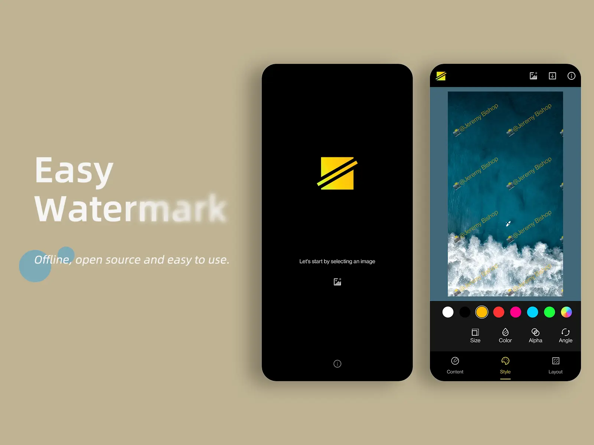
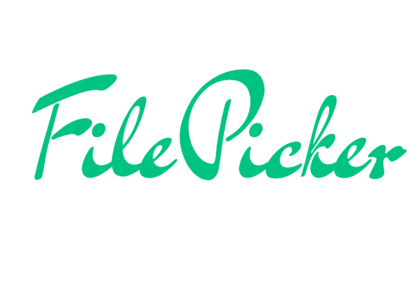

  

  <b><a href="https://ysl.rosuh.me/atlas/">Yellowstone Sound Atlas</a></b>
   
  A playable listening atlas built from Yellowstone's public sound archive.

# rosu

Software engineer in Shenzhen. I build Android products, live audio/video systems, and agent-shaped tools.

I care about software that treats attention as finite: fast paths, quiet interfaces, and tiny details that make a tool feel considerate. Currently at [TikTok](https://www.tiktok.com/), working on creative agent systems. Before that, I spent years around live streaming, RTC, Kotlin, and mobile UI.

## What I Keep Making

- Interfaces that feel immediate on small screens
- Tools that turn rough workflows into calmer habits
- Archives and experiments that become shareable objects

## Other Work

<table>
  <tr>
    <td width="50%" valign="top">
      
       
      <b><a href="https://aicommit.app/">AICommit</a></b>
       
      An IntelliJ IDEA plugin that helps turn code changes into clearer commit messages without leaving the editor.
    </td>
    <td width="50%" valign="top">
      
       
      <b><a href="https://github.com/rosuH/EasyWatermark">Easy Watermark</a></b>
       
      An Android tool for adding watermarks to photos, built around a small everyday privacy need.
    </td>
  </tr>
  <tr>
    <td width="50%" valign="top">
      
       
      <b><a href="https://github.com/rosuH/AndroidFilePicker">AndroidFilePicker</a></b>
       
      An open-source Android file picker library shaped around smooth selection and predictable UI.
    </td>
    <td width="50%" valign="top">
      <b>Small thread</b>
       
      These projects sit in different places, but they share the same bias: make a useful thing, keep the surface calm, and leave room for the person using it.
    </td>
  </tr>
</table>

## Elsewhere

[Home](https://rosuh.me) / [Blog](https://blog.rosuh.me) / [X](https://x.com/rosu_h) / [Email](mailto:hi@rosuh.me)

  

